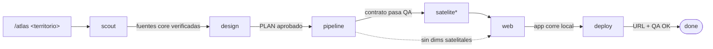

# tensor-atlas

**Un plugin de [Claude Code](https://claude.com/claude-code) que enseña a construir, paso a paso, cualquier _Atlas de Bienestar Humano Territorial_ al estilo de Tensor** — los mapas interactivos de [uraba.tensor.lat](https://uraba.tensor.lat) y [caba.tensor.lat](https://caba.tensor.lat).

No es una librería de código: es una **serie de _skills_** (guías ejecutables) que un agente sigue para llevar un territorio nuevo desde "no tengo nada" hasta "un atlas desplegado en producción", reusando el método y el _stack_ con que ya se construyeron Urabá y CABA.

---

## ¿Qué es un "Atlas de Tensor"?

Un atlas es un mapa coroplético interactivo que pinta un **Índice de Bienestar Territorial** sobre miles de unidades geográficas pequeñas (manzanas, radios censales), y deja explorar sus dimensiones (accesibilidad, ambiental, socioeconómico, seguridad), comparar zonas y leer fichas por barrio/comuna.

La clave que hace todo esto **replicable** es una observación de arquitectura:

> **Un atlas = un pipeline de datos en Python + un front Nuxt _data-agnóstico_.**
> El front no sabe de qué territorio habla. Consume un **contrato fijo de archivos**.
> Por eso **clonar un atlas ≈ reemplazar datos + renombrar constantes + rebranding**, no reescribir lógica.

```
┌─────────────────────────────┐         ┌──────────────────────────────┐
│   PIPELINE DE DATOS (Python)│         │   FRONT WEB (Nuxt 4 + Vue)   │
│                             │         │                              │
│  datos abiertos crudos      │         │  MapLibre GL + PMTiles       │
│   → reproyección CRS        │  emite  │  Pinia store · API REST Nitro│
│   → joins espaciales        │ ──────▶ │  Chart.js · Tailwind         │
│   → normalización/quintiles │ CONTRATO│                              │
│   → scores ponderados       │  DE     │  lee public/data/*.geojson   │
│   → tippecanoe → PMTiles    │  DATOS  │  + server/assets/data/*.json │
│   + satélite (GEE)          │         │  → pinta el territorio       │
└─────────────────────────────┘         └──────────────────────────────┘
        atlas-pipeline                          atlas-web
        atlas-satelite                          atlas-deploy
```

### Las dos mitades en detalle

**1. El contrato de datos** — el front exige estos archivos en `public/data/`, con nombres y campos exactos (ver [`references/data-contract.md`](references/data-contract.md)):

| Archivo | Qué es |
|---|---|
| `atlas.geojson` | unidad base con `atlas_score` + dimensiones + sub-scores + `zona` (LISA). **El corazón.** |
| `municipios.geojson` | agregación nivel 1 con score ponderado por población |
| `veredas.geojson` | agregación nivel 2 (capa de contexto) |
| `atlas_stats.json` / `atlas_stats_v3.json` | estadísticas para el mapa y para la API REST |
| `atlas_breaks.json`, `comunas_centroides.json`, `gap_analysis.json` | cortes de color, cámara, narrativa |
| `atlas.pmtiles` | tiles vectoriales (vía `tippecanoe`) para render veloz de miles de features |

El front usa un **vocabulario data-agnóstico** heredado de Urabá: `manzana` = unidad base, `municipio` = agregación 1, `vereda` = agregación 2. En CABA esos mismos campos representan radio censal / comuna / barrio. Los nombres de campo no cambian — **son el contrato, no etiquetas de UI**. (Para que las etiquetas visibles sí cambien por territorio, `atlas-web` introduce una **capa de alias de vocabulario** en el store.)

**2. El modelo de score** — estable entre atlas (ver [`references/scoring-methodology.md`](references/scoring-methodology.md)):

```
atlas_score = (0.40·accesibilidad + 0.25·ambiental + 0.25·socioeconómico + 0.20·seguridad) / Σpesos
```

Cuando una dimensión no tiene dato real, se **renormaliza** sobre las disponibles (p. ej. CABA Fase 1: `(0.40·acc + 0.25·soc) / 0.65`). Cada dimensión se compone de sub-scores (`score_salud`, `score_educacion`, `score_via`, `score_ndvi`, `score_calor`, `score_ndbi`, `score_viirs`, `score_nbi`) normalizados a `[0,1]` por min-max o quintiles, y la `zona` sale de autocorrelación espacial local (LISA / Moran).

---

## Las 7 skills

El plugin descompone el método en una skill por fase. Cada una es **invocable por separado** y está anclada en los repos reales (no inventada): incluye comandos exactos (`tippecanoe`, `reduceRegions`), nombres de campo literales y _caveats_ de procesamiento (reproyección EPSG:9498→4326, WKT embebido, RAR vs ZIP).

| # | Skill | Fase | Qué hace |
|---|-------|------|----------|
| — | **`atlas`** | orquestador | `/atlas <territorio>` — corre las fases 0→5 con _gates_ y un manifiesto de estado reanudable. Punto de entrada. |
| 0 | **`atlas-scout`** | descubrir | Fan-out multi-agente que **descubre y verifica en runtime** (HTTP 200 + datos reales + CRS + licencia) las fuentes de datos abiertos por dominio, sembrando desde la receta del país. → dossiers + brechas. |
| 1 | **`atlas-design`** | diseñar | Elige unidad base + 2 niveles de agregación, fija dimensiones y pesos, clasifica cada dimensión como dato-real / proxy / brecha. → `PLAN_CONSTRUCCION.md`. |
| 2 | **`atlas-pipeline`** | datos | Genera el pipeline Python que produce **el contrato de datos** y los PMTiles. → `public/data/*`. |
| 3 | **`atlas-satelite`** | satélite | Computa NDVI/NDBI/LST/VIIRS/cobertura por unidad con **Google Earth Engine** (`reduceRegions`). → CSV para merge. |
| 4 | **`atlas-web`** | front | Clona y rebrandea el front Nuxt; introduce la **capa de alias de vocabulario**. → `npm run dev` pintando el territorio. |
| 5 | **`atlas-deploy`** | desplegar | `npm run generate` + Vercel + dominio `*.tensor.lat` + **QA de datos y visual** página-por-página. → URL productiva. |

### El flujo end-to-end



Entre cada fase hay un **gate**: el orquestador no avanza hasta que la fase anterior cumple su criterio de salida (p. ej. "el contrato de datos tiene scores en `[0,1]`, sin NaN, y los conteos cuadran"). El estado vive en un `atlas.manifest.json` reanudable, así que si te detienes a mitad, `/atlas` retoma desde `fase_actual`.

---

## Cómo se usa

### 1. Instalar el plugin

```bash
# Clonar dentro de tu directorio de plugins de Claude Code, o
# añadirlo como marketplace local:
git clone https://github.com/Cespial/tensor-atlas.git
```

En Claude Code, registra el plugin (vía `/plugin` o tu `marketplace.json` local) apuntando a esta carpeta. Las skills aparecerán como `tensor-atlas:atlas`, `tensor-atlas:atlas-scout`, etc.

### 2. Construir un atlas completo

```
/atlas Manizales
```

El orquestador arranca la Fase 0 (scout), te pide confirmar el diseño del índice tras la Fase 1, y avanza fase por fase con _gates_.

### 3. O correr una sola fase

Cada skill es autónoma. Por ejemplo, si ya tienes los datos crudos y solo quieres el pipeline:

```
Usa la skill tensor-atlas:atlas-pipeline para emitir el contrato de datos de Manizales
```

---

## Estructura del repo

```
tensor-atlas/
├── .claude-plugin/plugin.json      # manifiesto del plugin
├── README.md                       # este archivo
├── skills/                         # las 7 skills (cada una un SKILL.md)
│   ├── atlas/                      #   orquestador  /atlas <territorio>
│   ├── atlas-scout/                #   Fase 0 · descubrir + verificar fuentes
│   ├── atlas-design/               #   Fase 1 · diseñar el índice
│   ├── atlas-pipeline/             #   Fase 2 · pipeline Python → contrato
│   ├── atlas-satelite/             #   Fase 3 · satélite GEE
│   ├── atlas-web/                  #   Fase 4 · clonar + rebrandear Nuxt
│   └── atlas-deploy/               #   Fase 5 · Vercel + QA
├── references/                     # conocimiento compartido, anclado en repos reales
│   ├── data-contract.md            #   los archivos exactos que el front exige
│   ├── scoring-methodology.md      #   dimensiones, pesos, normalización, LISA
│   ├── codebase-anatomy.md         #   qué editar/renombrar al clonar + capa de alias
│   └── recipes/                    #   catálogos de fuentes de datos abiertos
│       ├── _generico.md            #     método para cualquier territorio LatAm
│       ├── colombia.md             #     datos.gov.co, IGAC, DANE/CNPV, REPS, SIMAT, GEE…
│       └── argentina.md            #     BA Data/DGEyC, INDEC, IGN, USIG, OSRM, GEE…
└── docs/superpowers/specs/         # spec de diseño del plugin
```

Las skills enlazan las referencias por `${CLAUDE_PLUGIN_ROOT}/references/…`, así que el conocimiento compartido (contrato, scoring, recetas) vive en un solo lugar y no se duplica.

---

## El _stack_ que produces

| Capa | Tecnología |
|---|---|
| Datos | Python · GeoJSON · `tippecanoe` → PMTiles · DuckDB (opcional) |
| Satélite | Google Earth Engine (Sentinel-2, Landsat 8/9, VIIRS, ESA WorldCover) |
| Front | Nuxt 4 · Vue 3 · Pinia · MapLibre GL JS · PMTiles · Chart.js · Tailwind |
| API | Nitro (server routes de Nuxt) |
| Deploy | Vercel · dominio `*.tensor.lat` |

**Requisitos** para ejecutar el método: Node.js ≥ 22, Python 3.11, `tippecanoe`, una cuenta de Google Earth Engine autenticada (para las dimensiones satelitales) y una cuenta de Vercel (para desplegar).

---

## Alcance geográfico

El núcleo es **agnóstico de territorio**. Las "recetas" (`references/recipes/`) son catálogos de fuentes de datos abiertos por país:

- **Colombia** — anclada en el método de Atlas Urabá (IGAC, DANE/CNPV, TerriData DNP, REPS, SIMAT, SMByC, IDEAM, GEE).
- **Argentina** — anclada en Atlas CABA (BA Data/DGEyC, INDEC, IGN, USIG, OSRM/Geofabrik, GEE).
- **Genérica** — cómo investigar y verificar fuentes para cualquier territorio LatAm cuando no hay receta-país.

Añadir un país nuevo es escribir una receta más; las skills no cambian.

---

## Estado

`v0.1.0` — primera versión. Las 7 skills y las referencias están escritas y ancladas en los atlas reales de Urabá y CABA. Próximos pasos: un _dry-run_ del orquestador sobre un territorio chico para validar los _gates_ end-to-end, y endurecer las skills con pruebas de presión (metodología `superpowers:writing-skills`).

---

## Créditos

Construido por **[Tensor](https://tensor.lat)** (Cristian Espinal). Método destilado de los atlas [Urabá](https://uraba.tensor.lat) y [CABA](https://caba.tensor.lat).
